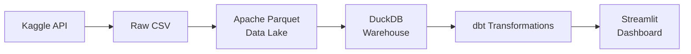

# 🏥 Skin Lesion Analytics Dashboard


An **end-to-end data engineering pipeline** that processes the **HAM10000** dermatoscopy dataset
(10,015 skin lesion images across 7 diagnostic categories) and presents insights through an
interactive **Streamlit dashboard**.

---

## 🎯 Problem Statement

> **Skin cancer is the most common cancer worldwide.** Early detection is critical for patient outcomes.
> This project builds a batch data pipeline to ingest, transform, and visualize metadata from the
> HAM10000 dataset — a large collection of multi-source dermatoscopic images of pigmented lesions.

### 🔍 Key Questions Answered

| Question | Visualization |
|----------|--------------|
| What is the distribution of diagnosis types? | 📊 Bar Chart |
| How do diagnoses vary across age groups? | 📈 Line Chart |
| Which body locations are most affected? | 🥧 Pie Chart |
| What are the key dataset metrics? | 📋 KPI Cards |

---

## 🏗️ Architecture



| Component | Technology | Purpose |
|-----------|------------|---------|
| 📥 **Data Source** | Kaggle API | Download HAM10000 dataset |
| 🗄️ **Data Lake** | Apache Parquet | Columnar storage, compression |
| 🏢 **Warehouse** | DuckDB | Embedded OLAP, clustered tables |
| 🔄 **Transformations** | dbt-duckdb | SQL-based ELT, testing, docs |
| 📊 **Dashboard** | Streamlit + Plotly | Interactive visualizations |
| ⚙️ **Orchestration** | Python DAG + Make | Pipeline automation |
| 💻 **Language** | Python / SQL | Core implementation |

---

## 📖 Project Overview

### What This Project Is
A **production-grade batch data engineering pipeline** that transforms raw dermatoscopy metadata into actionable clinical insights. Built with modern data stack tools (Parquet, DuckDB, dbt, Streamlit), it demonstrates end-to-end ELT best practices: ingestion, storage, transformation, testing, and visualization.

### How It Works
```
1. INGEST     → Kaggle API downloads HAM10000 CSV → converts to partitioned Parquet (data lake)
2. LOAD       → Parquet loaded into DuckDB as clustered table for fast OLAP queries
3. TRANSFORM  → dbt models: staging (clean) → marts (aggregated analytics)
4. TEST       → dbt tests validate schema, nulls, referential integrity, business rules
5. VISUALIZE  → Streamlit reads mart tables → renders interactive Plotly charts
```

### Problem It Solves
| Problem | Solution |
|---------|----------|
| **Manual CSV analysis** is slow & error-prone | Automated pipeline: raw → insights in one command (`make all`) |
| **No centralized analytics** for skin lesion metadata | dbt marts provide governed, tested, documented datasets |
| **Static reports** can't explore age/sex/location interactions | Interactive Streamlit dashboard with cross-filtering |
| **Scalability limits** of pandas/Excel on 10K+ records | DuckDB columnar engine handles 10M+ rows locally |
| **Reproducibility** across environments | Make + dbt + pinned dependencies = deterministic builds |

---

## 📊 Dataset: HAM10000

**"Human Against Machine with 10000 training images"**

- 🔗 **Source**: [Kaggle — Skin Cancer MNIST: HAM10000](https://www.kaggle.com/datasets/kmader/skin-cancer-mnist-ham10000)
- 📸 **10,015** dermatoscopic images with metadata
- 🏷️ **7 Diagnostic Categories**:
  1. `mel` — Melanoma
  2. `nv` — Melanocytic Nevi
  3. `bkl` — Benign Keratosis
  4. `bcc` — Basal Cell Carcinoma
  5. `akiec` — Actinic Keratoses
  6. `vasc` — Vascular Lesions
  7. `df` — Dermatofibroma
- 📋 **Metadata Fields**: `lesion_id`, `image_id`, `dx`, `dx_type`, `age`, `sex`, `localization`

---

## 🚀 Quick Start

### Prerequisites

- ✅ Python **3.10+**
- ✅ [Kaggle API credentials](https://www.kaggle.com/docs/api#authentication) — place `kaggle.json` in `~/.kaggle/`

### One-Command Setup

```bash
# Clone and enter project
cd skin-lesion-analytics

# Install deps + run full pipeline + launch dashboard
make all && make dashboard
```

### Step-by-Step

```bash
# 1️⃣ Install Python dependencies
make setup

# 2️⃣ Download dataset from Kaggle → convert to Parquet
make ingest

# 3️⃣ Load Parquet into DuckDB warehouse (clustered table)
make warehouse

# 4️⃣ Run dbt transformations (staging → marts)
make transform

# 5️⃣ Launch Streamlit dashboard 🎉
make dashboard
```

---

## 📁 Project Structure

```
skin-lesion-analytics/
├── Makefile                    # 🎛️ Pipeline orchestration
├── README.md                   # 📖 This file
├── SOLUTION.md                 # 📝 Detailed solution walkthrough
├── requirements.txt            # 📦 Python dependencies
├── .gitignore
├── pipeline/
│   ├── orchestrate.py          # 🔄 DAG runner (ingest → warehouse → dbt → test)
│   ├── ingest.py               # ⬇️ Download from Kaggle → Parquet
│   └── load_warehouse.py       # 📥 Load Parquet → DuckDB (clustered)
├── dbt_skin_lesion/
│   ├── dbt_project.yml         # ⚙️ dbt project config
│   ├── profiles.yml            # 🔌 DuckDB connection profile
│   └── models/
│       ├── staging/
│       │   ├── stg_lesions.sql # 🧹 Clean & standardize raw data
│       │   └── schema.yml      # 📋 Tests & documentation
│       └── marts/
│           ├── diagnosis_summary.sql        # 📊 Diagnosis distribution
│           ├── demographics_analysis.sql    # 👥 Age/sex breakdown
│           ├── body_location_analysis.sql   # 📍 Localization stats
│           └── schema.yml                   # 📋 Tests & documentation
├── dashboard/
│   └── app.py                  # 🎨 Streamlit dashboard
├── data/                       # 🗂️ Raw & lake data (gitignored)
└── warehouse/                  # 🦆 DuckDB database (gitignored)
```

---

## 📸 Dashboard Preview

| View | Description |
|------|-------------|
| **📊 Diagnosis Distribution** | Bar chart of lesion types across 7 categories |
| **📈 Cases by Age Group** | Line chart showing diagnosis trends across age bands |
| **🥧 Body Location Breakdown** | Pie chart of affected anatomical sites |
| **📋 Key Metrics** | Total images, unique lesions, diagnosis types, avg age |

> Run `make dashboard` to open the interactive dashboard in your browser at `http://localhost:8501`

---

## 🧪 Testing & Quality

```bash
# Run dbt tests (schema, null checks, referential integrity)
make test

# Run all pipeline steps with validation
make all
```

---

## 🧹 Cleaning Up

```bash
# Remove generated data, warehouse, and cache
make clean
```

---

## 📚 Documentation

- 📖 **[SOLUTION.md](SOLUTION.md)** — Detailed architecture decisions, data models, and implementation walkthrough
- 📦 **dbt Docs** — Run `dbt docs generate && dbt docs serve` from `dbt_skin_lesion/` for interactive lineage

---

## 🤝 Contributing

1. Fork the repository
2. Create a feature branch (`git checkout -b feature/amazing-feature`)
3. Commit changes (`git commit -m 'Add amazing feature'`)
4. Push to branch (`git push origin feature/amazing-feature`)
5. Open a Pull Request

---

## 📄 License

Distributed under the **MIT License**. See `LICENSE` for more information.

---

## 🙏 Acknowledgments

- **HAM10000 Dataset**: Tschandl et al., *The HAM10000 dataset*, 2018
- **Kaggle** for hosting the dataset
- **Streamlit**, **DuckDB**, **dbt**, **Plotly** communities for amazing tools

---
